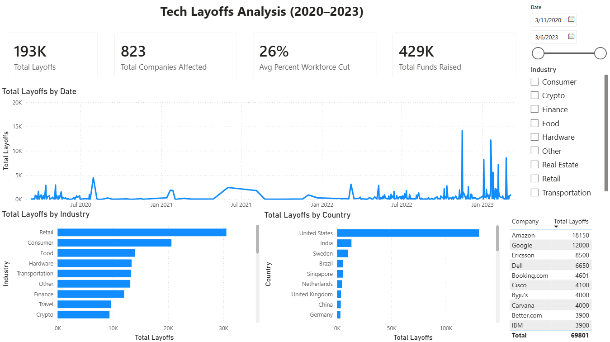

# Tech Layoffs Analysis (2020–2023)

Analysis of global tech industry layoffs — from raw data to an interactive dashboard.

**Tools:** SQL · Python (Pandas, Matplotlib) · Power BI

## Dashboard

## Pipeline

SQL (cleaning) → Python (EDA) → Power BI (visualization)

## Key Findings

- Retail was the hardest-hit industry following Consumer, Finance, Travel, and Crypto.
- The United States accounted for the large majority of global layoffs, far ahead of India and other countries.
- Layoffs stayed relatively low through 2020–2021, then spiked sharply from late 2022, peaking in January 2023 with a single-day event over 15,000 layoffs.
- Amazon had the most layoffs overall (18,150), about 50% more than Google (12,000).
- 823 companies were affected, with an average of 26% of workforce cut per company.

## Files

- `datacleaning_script.sql` — data cleaning
- `layoffs_eda.ipynb` — exploratory analysis
- `layoffs_cleaned.csv` — final dataset
- `tech_layoffs_dashboard.pbix` — Power BI dashboard
